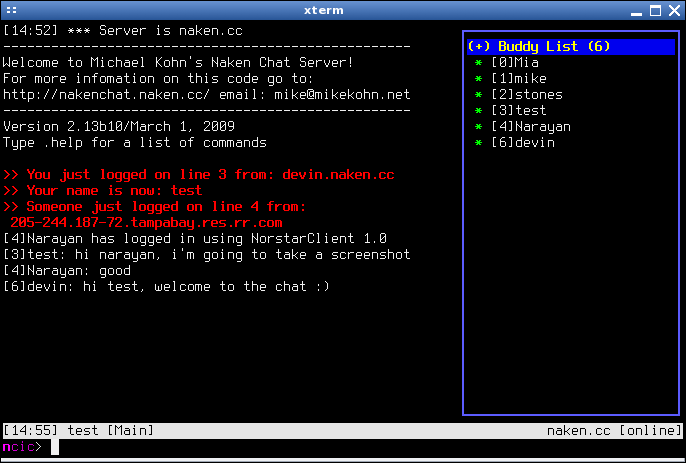

ncic
====

1. About ncic

   `ncic` is a chat client for Michael Kohn's [chat server](https://www.mikekohn.net/software/nakenchat.php).

2. Who wrote ncic?

   See AUTHORS

3. What is the license that ncic is distributed under?

   The GPL. Also see COPYING

4. What systems does it work on?

   Probably any Unix or Unix derivative that supports NCurses.

   I have tested it on the following platforms. I regularly use it on Linux so that is the best supported option. 

   | OS              | Versions | Arch     |
   | --------------- | -------- | -------- |
   | OpenBSD         | 4.2-5.9  | PowerPC  |
   | OpenBSD         | 4.2-4.5  | i386     |
   | FreeBSD         | 10.2     | amd64    |
   | MacOS X Server  | 10.4.10  | i386     |
   | Slackware Linux | 12.2+     | i386     |
   | Ubuntu          | 16.04+    | amd64    |
   | Debian          | 9 (Stretch) and higher   | amd64    |

# Screenshot




Building
========
Under Linux, cmake, ncurses and ssl development libraries are required. On a Debian
based distribution you can execute the following command:

```
sudo apt-get install cmake ncurses-dev libssl-dev
```

Other versions of Linux/Unix typically have ncurses installed by default.


After, type:

```
mkdir build
cd build
cmake ..
make
sudo make install
```

You should then be able to simply run `ncic` by executing `ncic`. You can connect
to a server by typing

```
/connect yourname naken.cc
```

and pressing enter. If you use a password use

```
/connect yourname=password naken.cc
```

